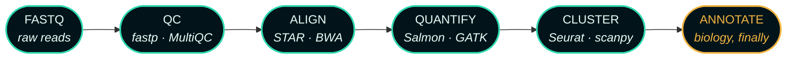

<!-- ════════════════════════  HEADER  ════════════════════════ -->


<p align="center">
  <a href="https://github.com/Bioinformatician-dev">
    
  </a>
</p>

<p align="center">
  <a href="https://www.linkedin.com/in/salma-hafeez/"></a>
  <a href="mailto:salmahafeez575@gmail.com"></a>
  <a href="https://github.com/Bioinformatician-dev?tab=repositories"></a>
  
</p>

<p align="center">
  
</p>

<!-- ════════════════════════  QUICK FACTS  ════════════════════════ -->

## 

```yaml
role:          Bioinformatician
focus:         NGS · scRNA-seq · Multi-Omics Integration · Variant Analysis
currently:     Reproducible pipelines for translational genomics research
learning:      Spatial omics & multi-modal data integration
collab_on:     Biomedical data analysis, open-source bioinformatics tools
publications:  2 peer-reviewed · 1 under review
trained_at:    NUST Islamabad · COMSATS · MDC-BIMSB, Berlin
reach_me:      salmahafeez575@gmail.com
```

<p align="center">
  
</p>

<!-- ════════════════════════  PIPELINE  ════════════════════════ -->

## 



<p align="center"><sub><b>One command in. Same result out, every time.</b> — orchestrated with Snakemake / Nextflow</sub></p>

<table align="center">
<tr>
<td width="33%" valign="top">

**🔬 Single-Cell & NGS**

QC → normalization → clustering → marker genes → annotation, end-to-end in R and Python.

</td>
<td width="33%" valign="top">

**🧪 Multi-Omics Integration**

Transcriptomics and proteomics fused into ML-ready feature sets for disease modeling.

</td>
<td width="33%" valign="top">

**♻️ Reproducible Pipelines**

Version-controlled, documented workflows built for one-command reruns.

</td>
</tr>
</table>

<p align="center">
  
</p>

<!-- ════════════════════════  TECH STACK  ════════════════════════ -->

## 

<p align="center">
  
</p>

<details>
<summary><b>🧬 Domain toolchain</b> — the things that don't have a skillicon</summary>
<br>
<p align="center">
  
  
  
  
  
  
  
  
  
  
</p>

| Layer | What I reach for |
| :--- | :--- |
| **Wrangling** | pandas · dplyr · data.table · AnnData |
| **Single-cell** | Seurat · scanpy · Harmony · SingleR |
| **Variants** | GATK · bcftools · ANNOVAR |
| **Orchestration** | Snakemake · Nextflow · Docker · Conda |
| **Modeling** | scikit-learn · TensorFlow · limma · DESeq2 |

</details>

<p align="center">
  
</p>

<!-- ════════════════════════  PROJECTS  ════════════════════════ -->

## 

<p align="center">
  <a href="https://github.com/Bioinformatician-dev/Alzheimer-s-Disease-Classification-">
    
  </a>
  <a href="https://github.com/Bioinformatician-dev/Parkinson-s-Disease-Classification-using-SVM">
    
  </a>
</p>
<p align="center">
  <a href="https://github.com/Bioinformatician-dev/naive-bayes-iris-classifier">
    
  </a>
  <a href="https://github.com/Bioinformatician-dev?tab=repositories">
    
  </a>
</p>

<!-- ════════════════════════  PUBLICATIONS  ════════════════════════ -->

## 

- **Khalid, Hafeez & Jabeen (2024)** — *Molecular Modeling Studies to Mimic the Binding Hypothesis of NEU3 Sialidase and EGFR in Non-small Cell Lung Carcinoma*
- **Hafeez, Aslam & Hasnain** — *Pathway Network Analysis of Genes Involved in Dominant Syndromes*
- 🔬 *Genetic-Driven Biomarkers for Liver Carcinoma* — 

<p align="center">
  
</p>

<!-- ════════════════════════  STATS  ════════════════════════ -->

## 

<p align="center">
  
  
</p>

<p align="center">
  
</p>

<p align="center">
  
</p>

<!-- ════════════════════════  SNAKE  ════════════════════════ -->

## 

<p align="center">
  
</p>

<p align="center">
  
</p>

<p align="center">
  
</p>

<!-- ════════════════════════  FOOTER  ════════════════════════ -->

<p align="center">
  <a href="https://readme-typing-svg.demolab.com">
    
  </a>
</p>

<p align="center">
  <i>🧫 NUST Islamabad · COMSATS · Biocode Ltd. — trained at MDC-BIMSB, Berlin</i>
</p>


